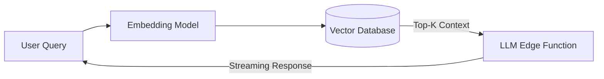

# Enterprise RAG Engine

An enterprise-ready Retrieval-Augmented Generation (RAG) system built in Python. I focused heavily on the "Day 2" operational requirements that simple notebook tutorials ignore, such as streaming, citation accuracy, and evaluation.

## Tech Stack
- **Python**
- **Vector Databases** (Pinecone / local embeddings)
- **RAG Architecture** (Chunking, retrieval, generation)
- **Evaluation** (Custom eval scripts for retrieval precision)
- **Deployment** (Vercel Edge functions for low-latency streaming)


## Architecture



## Live Endpoint (Interactive Demo)
This project is deployed as a serverless backend on Vercel. You can test the API instantly via your terminal.

```bash
# Example Request
curl -X GET https://enterprise-rag-engine-1vk51ya5k-dev4aibots.vercel.app/api/health
```

## Demo
To generate a terminal GIF demonstration using `vhs`, run:
```bash
vhs demo.tape
```
