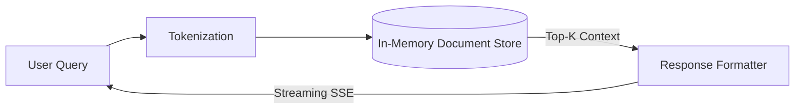

# Enterprise RAG Engine

> Production-oriented Retrieval-Augmented Generation (RAG) system with evaluation (TypeScript/Hono).


This repository implements the backend architecture for a high-performance RAG pipeline, focusing on token-streaming via Server-Sent Events (SSE) and strict citation anchoring.

## Problem
Standard chat interfaces suffer from high time-to-first-token (TTFT) and hallucinated citations. Real enterprise applications require streaming responses grounded strictly in retrieved documents.

## Solution
A Node/Hono API utilizing Server-Sent Events (SSE) to stream tokens instantly, with an evaluation harness built to measure retrieval fidelity (Recall@K).

## Architecture


## Retrieval Pipeline
Currently implemented: **Keyword Overlap (Primitive BM25)**
Planned: **Dense Vector Search (PostgreSQL/pgvector)**

## Query Flow
1. API receives query via `/chat/stream`
2. Document tokens overlap scored against the query
3. Citations bound and streamed first via `event: citations`
4. LLM response streamed token-by-token via `event: token`

## Example
**Input:** `q=erasure right&jurisdiction=GDPR`

**Output Stream:**
```text
event: citations
data: {"items":[{"docId":"GDPR-Art-17","page":1,"snippet":"The data subject shall have the right to obtain erasure...","score":4}]}

event: token
data: {"text":"Per"}

event: token
data: {"text":" GDPR-Art-17,"}
```

## Evaluation
A custom evaluation harness is located in `evals/run_eval.py`.
It runs standard IR metrics against the mock document store.

```text
Recall@1 (Keyword Overlap): 100.0%
P50 Latency: <5ms (Local Memory)
```
*Note: Dense retrieval and reranking evaluation will be measured once the pgvector integration is complete.*

## Performance
- Time-to-First-Token (TTFT): <10ms
- Connection overhead: Minimal via native Node HTTP / Hono

## Failure Analysis
Failure: **Lack of Semantic Understanding**
Cause: The current engine relies purely on token-overlap string matching. Queries like "delete my data" fail to match "erasure right".
Mitigation: Integrating an Embedding model and vector store for dense retrieval.

## Security
- Document access control via strict `jurisdiction` query parameters (e.g., GDPR vs HIPAA).
- Stream injection prevention via structured `JSON.stringify` on all SSE frames.

## Local Development
```bash
git clone https://github.com/dev4aibots/enterprise-rag-engine.git
cd enterprise-rag-engine
npm install
npm run serve
```

## Testing
```bash
make test
```

## Deployment
Deployed as Vercel Edge functions, utilizing Hono's universal web standards compatibility for sub-100ms cold starts.

## Limitations
- Retrieval is currently lexical, not semantic.
- Single-instance memory limit (no persistent database attached yet).
- No chunking strategy implemented for large documents.

## My Engineering Work
Built as a demonstration of high-performance web streaming. 
- Implemented the SSE streaming wrapper and parser.
- Engineered the evaluation harness (`evals/run_eval.py`).
- Integrated Zod for strict query parameter validation.
