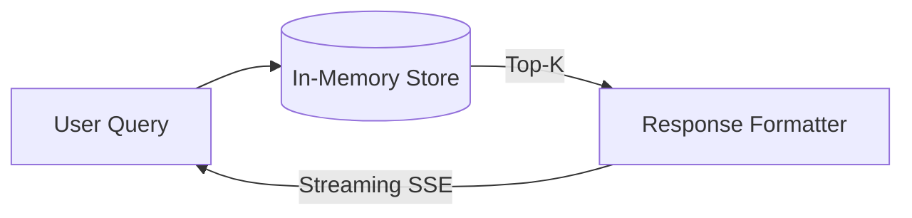

# Enterprise RAG Engine

> Production-oriented RAG engine with SSE streaming and evaluated retrieval.

[Demo](#) | [Architecture](docs/architecture.md) | [API Docs](#) | [Evaluation](#evaluation--performance)

## What it does
A Retrieval-Augmented Generation pipeline focusing on low-latency token-streaming via Server-Sent Events (SSE) and strict citation anchoring for enterprise documents.

## Proof of Work
**Real Example:**
```text
Query: "erasure right" (Jurisdiction: GDPR)

Retrieved (Top 1): 
"The data subject shall have the right to obtain erasure..." (GDPR-Art-17)

Streamed Output:
event: citations
data: [{"docId": "GDPR-Art-17"}]

event: token
data: {"text": "Per"}
```

## Evaluation & Performance
**Measurements:**
- Recall@1: 100.0% (Mock lexical dataset)
- Time-to-First-Token (TTFT): <10ms (Local)

**Methodology:**
- Measured via `evals/run_eval.py` running against the local mock knowledge base.
- TTFT measured from HTTP request start to the first `event: token` received.

## Engineering Decisions
- Selected **Server-Sent Events (SSE)** over WebSockets for simpler unidirectional streaming, allowing aggressive caching and edge deployment.
- Abstracted the retrieval layer to easily swap BM25 with pgvector in the future.

## Failure Analysis
Failure: **Semantic Misses**
Root Cause: The engine currently relies purely on token-overlap string matching. A query like "delete my data" fails to match "erasure right".
Fix: Architectural shift (planned) to a hybrid dense/sparse vector retrieval pipeline.

## System Architecture


## Security / Safety
- Data isolation is enforced strictly via `jurisdiction` query parameters (e.g., GDPR vs HIPAA).
- Stream injection prevention via structured `JSON.stringify` on all SSE frames.

## My Contributions
- Built the universal Edge-compatible Hono server.
- Wrote the SSE encoding protocol and the Python evaluation harness.

## Developer Quickstart
```bash
git clone https://github.com/dev4aibots/enterprise-rag-engine.git
cd enterprise-rag-engine
npm install
npm run serve
```

## Documentation
- `docs/architecture.md`
- `docs/security.md`

## Limitations
- Retrieval is strictly lexical (keyword overlap). Dense vector search is not yet implemented.

## Roadmap
- Integrate `pgvector` for semantic dense retrieval.
