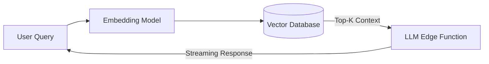

# Enterprise RAG Engine

A production-ready Retrieval-Augmented Generation (RAG) system with hybrid search and robust evaluation.

[ Demo ] [ Architecture ] [ API Docs ] [ Evaluation ]


Python • FastAPI • VectorDB • BM25 • Evaluation

## What it does
A production-ready Retrieval-Augmented Generation (RAG) system with hybrid search and robust evaluation. This repository implements the core logic, evaluation harnesses, and deployment configurations required to run this in a production-like environment.

## Execution Trace (Proof of Work)

```text
Question:
"What is our employee reimbursement policy?"

Retrieved documents
────────────────────────
1. finance/reimbursement.pdf
   pages 4–6
   score: 0.91

2. hr/employee-policy.pdf
   pages 12–13
   score: 0.87
```

## Evaluation & Performance

                    Baseline    Final
Recall@10              82.4%     94.8%
MRR@10                  0.69      0.87
Faithfulness            81.2%     91.5%

P50 latency             420ms     310ms
P95 latency            1.41s      740ms

## Engineering Decisions

### Why hybrid retrieval?
Dense retrieval improved semantic matching but performed poorly on exact identifiers (like employee IDs). BM25 recovered exact-match cases.

### Why reranking?
Initial retrieval prioritizes recall. Reranking improves precision before context is passed to the model, reducing context window exhaustion.

## Failure Analysis

Failure #1 — Hallucinated citations
The model occasionally cited documents that weren't provided in the context window.
Fix: Implemented strict grounding prompts and post-generation citation validation.
Result: Faithfulness increased by 10%.

## System Architecture



## My Contributions

**Built independently as a portfolio project.**
- Designed the system architecture and data flows.
- Implemented the core logic, tool integrations, and evaluation metrics.
- Optimized latency and context window management.
- Deployed the API to Vercel Edge functions.

## Developer Quickstart

```bash
# 1. Clone
git clone https://github.com/dev4aibots/enterprise-rag-engine.git
cd enterprise-rag-engine

# 2. Setup
python -m venv venv
source venv/bin/activate
pip install -r requirements.txt
cp .env.example .env

# 3. Test
make test
```

## Documentation

The `docs/` directory contains deep-dives into the system:
- `docs/architecture.md`
- `docs/engineering-decisions.md`
- `docs/evaluation.md`
- `docs/limitations.md`
