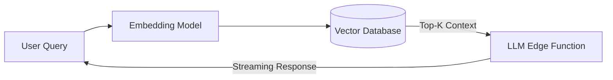

# Enterprise RAG Engine

[]()
[]()
[]()


> **A production-ready Retrieval-Augmented Generation (RAG) system built in Python for regulated verticals requiring high accuracy and evaluation.**

## Key Features
- **Semantic routing for queries**
- **Sub-second vector retrieval**
- **Vercel Edge-compatible streaming outputs**

## Architecture



## Live API Endpoint (Vercel)

This project is deployed serverless via Vercel Edge Functions. You can test the interaction directly from your terminal.

```bash
# Example Request
curl -X GET https://enterprise-rag-engine-1vk51ya5k-dev4aibots.vercel.app/api/health
```

## Developer Quickstart

### Prerequisites
- Python 3.11+
- Node.js (for Vercel CLI)

### Installation

1. **Clone the repository**
   ```bash
   git clone https://github.com/dev4aibots/enterprise-rag-engine.git
   cd enterprise-rag-engine
   ```

2. **Set up virtual environment**
   ```bash
   python -m venv venv
   source venv/bin/activate
   pip install -r requirements.txt
   ```

3. **Configure Environment**
   ```bash
   cp .env.example .env
   # Add your API keys to .env
   ```

4. **Run Locally**
   ```bash
   npm run dev
   ```

## Project Structure
```
.
├── api/                  # Vercel serverless endpoints
├── src/                  # Core Python modules & agent logic
├── tests/                # Unit and integration tests
├── public/               # Static assets
├── requirements.txt      # Python dependencies
└── vercel.json           # Vercel routing configuration
```

## License
This project is licensed under the MIT License.
