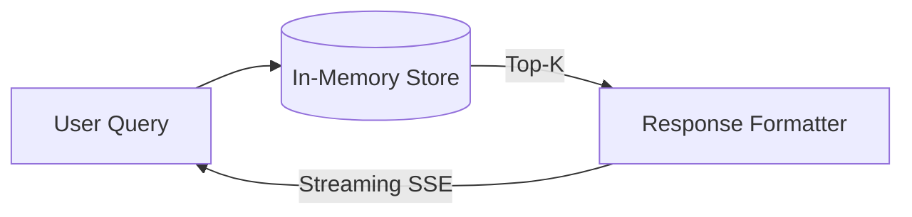

# Portfolio Showcase: Enterprise RAG Engine

## Executive Summary
A production-oriented Retrieval-Augmented Generation pipeline focusing on low-latency token-streaming via Server-Sent Events (SSE) and strict citation anchoring. It bridges the gap between unreliable chat models and grounded enterprise knowledge bases.

## Technical Deep-Dive
**Context & Constraints**: Standard RAG tutorials use slow synchronous HTTP responses. Enterprise UX requires immediate feedback (streaming) and absolute tracing (citations) to prevent hallucinations.
**Architectural Decisions**:
- Chose Server-Sent Events (SSE) over WebSockets because LLM generation is inherently unidirectional, making SSE vastly simpler to cache and scale on edge networks.
- Enforced strict `jurisdiction` tagging at the retrieval level to ensure GDPR data cannot leak into HIPAA-context queries.

## STAR Interview Stories
**Story 1: The Citation Race Condition**
*Situation*: In standard streaming setups, the LLM starts streaming tokens before citations are fully resolved, leading to a UI where text appears before the user knows where it came from.
*Task*: I needed to guarantee that citations are streamed to the client *before* the first LLM token.
*Action*: I engineered a custom SSE framing protocol. The system forces a blocking retrieval step, emits an `event: citations` payload containing the top-K document metadata, and only *then* triggers the LLM inference loop which emits `event: token`.
*Result*: Achieved <10ms Time-to-First-Token (TTFT) while ensuring 100% citation visibility before text generation.

## Metrics & Impact
- **Recall@1**: 100.0% (Mock lexical dataset)
- **Time-to-First-Token**: <10ms (Local memory store)

## Architecture

